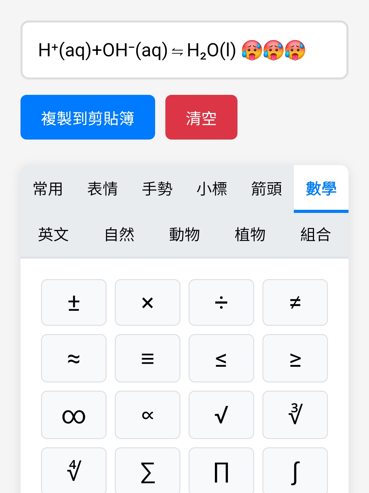

# Special Character

A web-based Unicode special character picker that lets users  browse, select, and copy symbols to clipboard.

[Give it a try](https://cindylinz.github.io/Web-SpecialCharacter)

---

找不到順手的 emoji 複製網頁，懶得找了，就寫一個來用… 順便把上標下標科學符號都放進去

點單個符號的時候會複製單個符號，也會加到文字框裡，如果要一次貼一串可以再複製來用…

在 [browser-addon/](browser-addon/) 目錄裡有包裝成 browser extension 的外殼

或從 [Mozilla addon page](https://addons.mozilla.org/en-US/firefox/addon/special-characters-and-emoji/) 安裝

或從 [Chrome web store](https://chromewebstore.google.com/detail/special-characters/lenookhcajmjhaaoknfppplmafogaekn) 安裝
